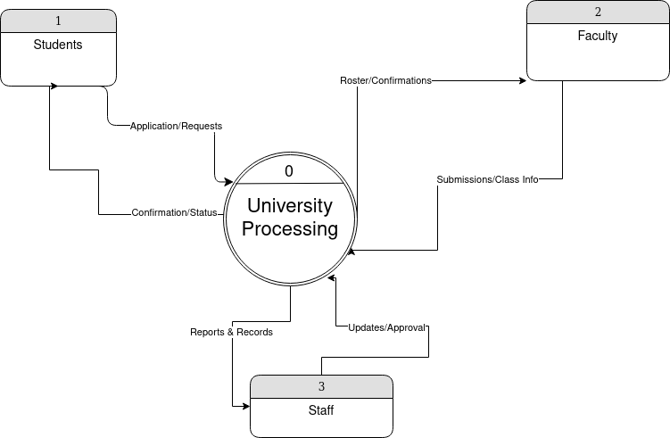
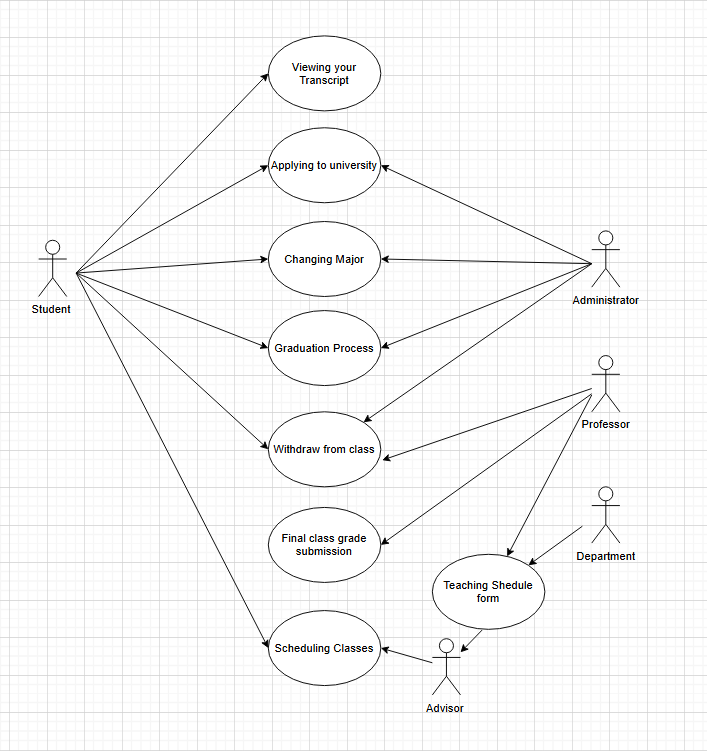

# Systems Analysis Project

**Gislain Rubuto**  
**Phillip Phuong**  
**Anthony Boykin**  
**Carola Gonzalez**  

---

## Introduction

### Purpose  
This document outlines the system analysis for a university process management system. The goal is to improve system tasks such as:  
- Applying to the university  
- Scheduling classes  
- Withdrawing from a class  
- Final grade submission  
- Changing majors  
- Viewing transcripts  
- Graduation  

### Scope  
This document covers the system requirements, context diagrams, use case definitions, data dictionary, and process specification.

### Definitions & Acronyms  
**DFD: Data Flow Diagram**  
A data flow diagram (DFD) is a graphical representation that visually depicts how data moves through a system or process, illustrating the flow of information from its source to its destination, including where it is stored and how it is transformed along the way, using standardized symbols to represent different elements like processes, data stores, and external entities.  

**ERD: Entity Relationship Diagram**  
An entity relationship diagram (ERD) is a visual representation that shows how different entities (people, objects, or concepts) relate to each other within a system.  

**Use Case Diagram**  
A use case diagram is a visual representation of how users (called "actors") interact with a system, highlighting the different functionalities and goals they can achieve within that system.  

**Data Dictionary**  
A data dictionary is a collection of detailed information about the data elements in a system, including names, types, sources, relationships, and usage rules. It serves as a reference for understanding and maintaining the data structure.  

**Process Specification**  
A process specification defines the logic, rules, and data flows involved in a specific process within a system. It provides a detailed description of how inputs are transformed into outputs.  

### References  
- University of Dayton system requirements  

### Overview  
This document provides:  
- An overview of the environment that this system must operate within, including other software and hardware systems that will interface with this system.  
- An overview of the features to be provided by the software.  
- A description of the types of users that will interact with this software and assumed properties of those users.  
- Any constraints that have been placed on the project (that are not, in themselves, requirements).  
- Any assumptions that are being made in specifying these requirements.  

---

**CPS 310 - Phase 1 - System Overview & Use Cases**  

---

## Overall Description

### Product Perspective  
The system's goal is to interface with the student management and university databases that are currently in place. It will act as a focal point for managing administrative procedures for students.

### Product Functions  
- Applying to the university  
- Scheduling classes  
- Withdrawing from a class  
- Final class grade submission  
- Changing your major  
- Viewing your transcript  
- Graduation process  
- Dropping out of the university  

### User Characteristics  
- **Students**: Primary users interacting with the system for academic management  
- **Administrators**: Manage student records and approve requests  
- **Professors**: Submit final grades  

### Constraints  
- Web-based with mobile compatibility  

### Assumptions  
- Users have basic technical proficiency  
- University maintains up-to-date records  

---

## Systems Analysis

### Context Level Data Flow Diagram  
The Context-Level Data Flow Diagram includes the main process representing the University's processing system. The entities include:  
- **Students** – both enrolled and not yet enrolled  
- **Faculty** – manage approvals and update records via the system  
- **Staff** – store and retrieve records  

  

---

### Entity-Relationship Diagram  
The Entity-Relationship Diagram models the University Process Management System, capturing essential entities and their interactions. The primary entities include:  
- **Student**  
- **Graduation**  
- **Transcript**  
- **Major**  
- **University**  
- **Class**  
- **Professor**  
- **Faculty**  

Students interact with multiple processes through associative entities such as:  
- **Graduation Status** – tracks eligibility for graduation  
- **Grade Record** – associated with their transcript  
- **Enrollment** – manages course participation  
- **Schedule** – ensures students are properly registered for classes  
- **Major Assignment** – assigns a major, connecting to both the university and the faculty responsible for the program  

Professors are affiliated with a faculty and take on teaching assignments for classes, submitting grade submissions to evaluate student performance. Students apply to the university through the application process, which determines admission status.  

  

---

### Use Case Diagram  
The following actors and processes are represented in the use case diagram:  

- **Student** – interacts with the system to:  
    - View transcript  
    - Apply to university  
    - Change major  
    - Complete the graduation process  
    - Withdraw from a class  
    - Schedule classes  

- **Advisor** – communicates with the system to:  
    - Schedule classes  
    - Reference the teaching schedule form  

- **Department** – manages the **teaching schedule form**  

- **Teaching Schedule Form** – links to both the advisor and department  

- **Professor** – interacts with the system to:  
    - Submit final class grades  
    - Withdraw from a class  
    - Reference the teaching schedule form  

- **Administrator** – manages key system processes:  
    - Applying to university  
    - Changing majors  
    - Graduation process  
    - Withdrawing from a class  

  

Detailed use case scenarios for each actor and process can be found in the [Use Case Scenarios](case.md) file.

---

**CPS 310 – Phase 2 – Data Flow Diagrams, Data Dictionary, Process Specification**  

---

### Diagram 0  
Diagram 0 expands on the context-level data flow diagram, breaking down the system's processes into more detailed components. It identifies key inputs, outputs, and data transformations within the university system.  

  

#### **Process 1 Child Diagram**  
The following child diagram provides a more detailed view of **Process 1**, showing the specific data flows and subprocesses involved.  

  

---

### Context Dictionary  

#### **Data Flow Descriptions**  
Detailed descriptions of how data moves through the system can be found in the [Data Flow Description](Data%20Dictionary/Data%20Flow%20Description.md) file.  

#### **Data Store Descriptions**  
Information about data stores and how they are structured is available in the [Data Store Description](Data%20Dictionary/Data%20Store%20Description.md) file.  

#### **Data Structures**  
A complete breakdown of the data structures used in the system can be found in the [Data Structures](Data%20Dictionary/Data%20Structures.md) file.  

#### **Data Element Descriptions**  
Descriptions of individual data elements, including their types and meanings, are located in the [Data Element Description](Data%20Dictionary/Data%20Element%20Description.md) file.  

---

### Process Specification  
Detailed specifications for each process in the system, including logic and rules are provided in the file.  

---

### **Future Process Breakdown**  
Due to the requirements of Phase 2 and the time constraints, the following processes were not broken down into child processes or assigned detailed process specifications. However, these processes could logically be expanded into child processes in the future:

1. **Class Withdrawal (Process 2)**  
   - **Reason:**  
     Withdrawal typically involves multiple steps, such as:  
     - Validating withdrawal request (e.g., checking deadlines, financial holds).  
     - Updating student and class records.  
     - Notifying relevant parties (e.g., faculty, administrative offices).  
     Each of these could be a distinct child process.

2. **Grade Submission (Process 3)**  
   - **Reason:**  
     Grading often involves multiple steps, such as:  
     - Validating the submitted grade (e.g., ensuring it’s within range).  
     - Updating grade records.  
     - Handling grade disputes or corrections.  
     Each of these could be a distinct child process.

3. **Application (Process 4)**  
   - **Reason:**  
     Processing an application could involve:  
     - Receiving and validating the application.  
     - Reviewing the application (possibly by multiple staff members).  
     - Sending approval/rejection notifications.  
     Each of these could be a distinct child process.

4. **Changing Major (Process 5)**  
   - **Reason:**  
     Changing a major might involve:  
     - Validating eligibility (e.g., GPA requirements).  
     - Approving or denying the request.  
     - Updating student records.  
     Each of these could be a distinct child process.